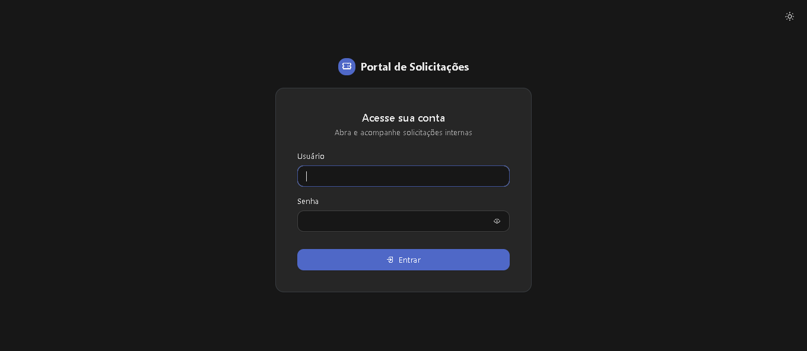
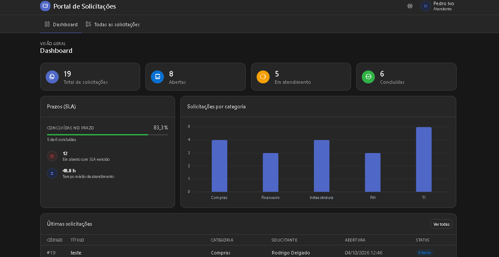
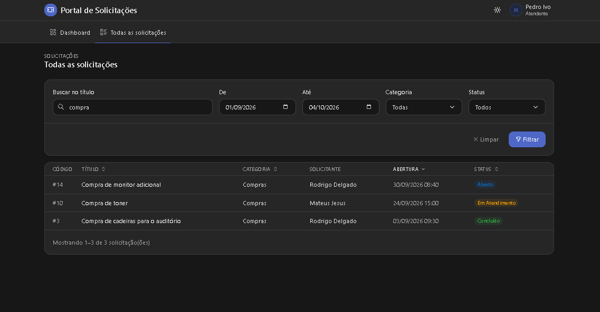
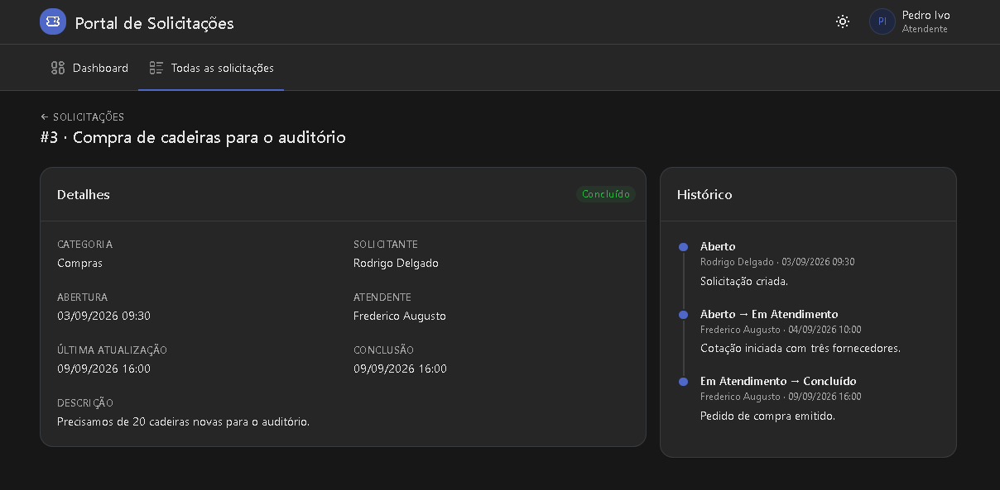

# Portal de Solicitações Internas

Sistema web para registrar, acompanhar e atender solicitações internas (TI, RH, Compras, Financeiro e Infraestrutura).
Colaboradores **solicitantes** abrem e acompanham as próprias solicitações; **atendentes** visualizam todas e conduzem
o atendimento pelo fluxo **Aberto → Em Atendimento → Concluído**, com histórico de cada mudança.

Desenvolvido como mini-projeto Full Stack para o processo seletivo de Desenvolvedor Jr.

- **Backend:** API REST em PHP 8.2 (sem framework), arquitetura em camadas
- **Frontend:** HTML, JavaScript e Tabler (Bootstrap 5), consumindo a API
- **Banco de dados:** MySQL 8

> As decisões técnicas estão no [Memorial Técnico de Desenvolvimento](docs/MEMORIAL_TECNICO.md)
> e a estrutura do banco no [Dicionário de Dados](docs/DICIONARIO_DE_DADOS.md).

---

## Funcionalidades

- Login com sessão segura, logout e expiração por inatividade(tempo ajustável nas variaveis de ambiente)
- Bloqueio temporário após tentativas de login falhas (rate limiting) e registro de todas as tentativas
- Alteração da própria senha (menu do usuário), com política de senha forte e novo login obrigatório em seguida
- Controle de acesso por perfil:
  - **Solicitante:** cria solicitações; vê, edita e exclui apenas as próprias, e somente enquanto estiverem Abertas
  - **Atendente:** vê todas as solicitações e altera o status, sem pular etapas e sem reabrir as concluídas
- Listagem com filtros por período, categoria, status e título, ordenação e paginação
- Detalhes da solicitação com linha do tempo das mudanças de status e observações do atendente
- Dashboard com totais por status, indicadores de prazo (SLA), tempo médio de atendimento e gráfico por categoria
- Tema claro e escuro e layout responsivo

---

## Pré-requisitos

| Item | Versão | Observação |
| --- | --- | --- |
| PHP | 8.2 ou superior | Extensões `pdo_mysql` e `mbstring` habilitadas (já vêm ativas no XAMPP) |
| Composer | 2.x | Gerenciador de dependências do PHP |
| MySQL | 8.0 | Projeto desenvolvido e testado com MySQL 8.0 |
| Git | qualquer | Para clonar o repositório |
| Navegador | atual | Com acesso à internet: o Tabler e o Chart.js são carregados via CDN |

Dependências do PHP (instaladas pelo Composer): `vlucas/phpdotenv`; em desenvolvimento, `squizlabs/php_codesniffer`
(verificação do padrão de código).

### Instalando o PHP e o Composer

Se `php -v` e `composer -V` já respondem no terminal (com PHP 8.2 ou superior), pule esta seção.

<details>
<summary><b>Windows</b></summary>

**1. PHP** — escolha uma das opções:

- **Opção A — XAMPP:** instale o [XAMPP](https://www.apachefriends.org/) com PHP 8.2 ou superior. O PHP fica em
  `C:\xampp\php`, já com as extensões necessárias ativas.
- **Opção B — PHP avulso:**
  1. Em [windows.php.net/download](https://windows.php.net/download/), baixe o **Zip** da versão 8.2 ou superior,
     **x64 Thread Safe**, e extraia em `C:\php`.
  2. Na pasta `C:\php`, copie `php.ini-development` para `php.ini`.
  3. Abra o `php.ini` e remova o `;` do início destas linhas:
     ```ini
     extension_dir = "ext"
     extension=mbstring
     extension=openssl
     extension=pdo_mysql
     extension=zip
     ```
  Se, ao rodar `php -v`, o Windows acusar falta de `VCRUNTIME140.dll`, instale o **Visual C++ Redistributable**
  (x64), indicado na própria página de download do PHP.

**2. PATH** — para o comando `php` funcionar em qualquer pasta, adicione a pasta do PHP (`C:\xampp\php` ou
`C:\php`) à variável de ambiente `Path`: menu Iniciar → "Editar as variáveis de ambiente do sistema" →
**Variáveis de Ambiente** → em *Variáveis do usuário*, selecione `Path` → **Editar** → **Novo** → informe a pasta →
**OK**.

**3. Composer** — baixe e execute o **Composer-Setup.exe** em
[getcomposer.org/download](https://getcomposer.org/download/). Quando o instalador pedir, aponte para o
`php.exe` (`C:\xampp\php\php.exe` ou `C:\php\php.exe`); ele adiciona o `composer` ao `Path` automaticamente.
Feche e abra o terminal para surtir efeito.

</details>

<details>
<summary><b>macOS</b></summary>

**1. Homebrew** — se ainda não tiver o gerenciador de pacotes [Homebrew](https://brew.sh/), instale no Terminal:

```bash
/bin/bash -c "$(curl -fsSL https://raw.githubusercontent.com/Homebrew/install/HEAD/install.sh)"
```

Ao final, execute os comandos que o instalador mostrar em *Next steps* (eles adicionam o `brew` ao `PATH`).

**2. PHP e Composer:**

```bash
brew install php
brew install composer
```

O PHP do Homebrew já inclui as extensões `pdo_mysql` e `mbstring`.

</details>

**Conferindo a instalação** (em qualquer sistema):

```bash
php -v                                  # deve mostrar 8.2 ou superior
php -m | grep -iE "pdo_mysql|mbstring"  # deve listar as duas extensões
composer -V                             # deve mostrar Composer 2.x
```

No `cmd` ou PowerShell do Windows, onde não há `grep`, rode apenas `php -m` e procure as duas extensões na lista.

O MySQL 8.0 pode ser instalado pelo [instalador oficial](https://dev.mysql.com/downloads/mysql/8.0.html)
(Windows e macOS). O XAMPP traz MariaDB, e não MySQL; o projeto foi desenvolvido e testado com MySQL 8.0.

---

## Instalação

### 1. Clonar o repositório

```bash
git clone https://github.com/delgadoz/portal-solicitacoes.git
cd portal-solicitacoes
```

### 2. Banco de dados

Um único script cria o banco `portal_solicitacoes`, as tabelas, os dados de referência e os dados de demonstração:

```bash
mysql -u root -p --default-character-set=utf8mb4 < database/setup.sql
```

> O script pode ser executado novamente para restaurar os dados de demonstração: as tabelas são recriadas
> e os dados anteriores são perdidos.
>
> No Windows com Git Bash, a pergunta de senha pode travar com o redirecionamento `<`. Nesse caso, use:
> `winpty mysql -u root -p --default-character-set=utf8mb4 -e "source database/setup.sql"`
>
> Também é possível abrir `database/setup.sql` no MySQL Workbench e executá-lo por inteiro.

Os scripts individuais ficam em `database/migrations` (estrutura e dados essenciais) e `database/seeds`
(dados de demonstração); o `setup.sql` é a junção deles, na ordem correta.

### 3. Backend

```bash
cd backend
composer install
cp .env.example .env
```

Edite o arquivo `.env` com a senha do seu MySQL (veja [Configuração](#configuração)).

### 4. Frontend

Não há etapa de instalação nem de build: o frontend é composto por arquivos estáticos em `frontend/`,
servidos pelo mesmo servidor da API.

---

## Configuração

Variáveis do arquivo `backend/.env`:

| Variável | Padrão | Descrição |
| --- | --- | --- |
| `APP_ENV` | `dev` | `dev` exibe a mensagem de erros internos; em `prod`, o usuário recebe apenas uma mensagem genérica |
| `APP_URL` | `http://localhost:8080` | Endereço da aplicação |
| `APP_TIMEZONE` | `America/Fortaleza` | Fuso horário usado pelo PHP e pela conexão com o MySQL |
| `DB_HOST` | `127.0.0.1` | Servidor do MySQL |
| `DB_PORT` | `3306` | Porta do MySQL |
| `DB_NAME` | `portal_solicitacoes` | Nome do banco (o mesmo criado pelo `setup.sql`) |
| `DB_USER` | `root` | Usuário do MySQL |
| `DB_PASS` | *(vazio)* | Senha do MySQL — **ajuste para o seu ambiente** |
| `SESSION_LIFETIME` | `1800` | Tempo de inatividade, em segundos, até a sessão expirar |
| `LOGIN_MAX_TENTATIVAS` | `5` | Falhas de login permitidas antes do bloqueio |
| `LOGIN_JANELA_MINUTOS` | `15` | Janela de tempo, em minutos, considerada para o bloqueio |

---

## Execução

Dentro de `backend/`:

```bash
composer serve
```

O comando inicia o servidor embutido do PHP em `http://localhost:8080`, servindo **a API** (rotas `/api/...`)
e **o frontend** (demais arquivos) pela mesma origem. Não é necessário iniciar o frontend separadamente.

Acesse: **http://localhost:8080/login.html**

> Se a porta 8080 estiver ocupada, rode diretamente:
> `php -S localhost:8081 -t ../frontend public/index.php`

Verificação rápida da API: `http://localhost:8080/api/health` deve responder `{"data":{"status":"ok",...}}`.

---

## Acesso — usuários de demonstração

Senha de todos: **`Senha@123`**

| Usuário | Nome | Perfil | O que demonstrar |
| --- | --- | --- | --- |
| `rodrigodelgado` | Rodrigo Delgado | Solicitante | Criar, editar e excluir as próprias solicitações |
| `mateusjesus` | Mateus Jesus | Solicitante | Isolamento: não vê as solicitações do Rodrigo |
| `fredericoaugusto` | Frederico Augusto | Atendente | Ver todas e avançar o status |

Após 5 tentativas de login com senha errada em 15 minutos, o usuário é bloqueado temporariamente para aquele IP.

Para alterar a senha, use **Alterar senha** no menu do usuário (canto superior direito). A nova senha precisa ter
pelo menos 8 caracteres, com 1 letra maiúscula, 1 número e 1 caractere especial. Após a troca, a sessão é encerrada
e é preciso entrar com a nova senha. Para voltar às senhas de demonstração, execute o `database/setup.sql` novamente.

---

## Telas

As evidências da aplicação em funcionamento estão em [`docs/prints`](docs/prints).

| Login | Dashboard |
| --- | --- |
|  |  |

| Listagem com filtros | Detalhes e histórico |
| --- | --- |
|  |  |

---

## API

Todas as respostas são JSON. Sucesso: `{"data": ...}` (listas paginadas incluem `"meta"`).
Erro: `{"error": {"code", "message", "fields"}}`. Rotas protegidas exigem sessão; as que alteram dados exigem
também o cabeçalho `X-CSRF-Token` (o token é devolvido pelo login e por `/api/me`).

| Método | Rota | Acesso | Descrição |
| --- | --- | --- | --- |
| GET | `/api/health` | Público | Verifica se a API e o banco estão no ar |
| POST | `/api/login` | Público | Autentica (`usuario`, `senha`) |
| POST | `/api/logout` | Logado | Encerra a sessão |
| GET | `/api/me` | Logado | Usuário logado e token CSRF |
| PUT | `/api/me/senha` | Logado | Altera a própria senha (`senha_atual`, `nova_senha`, `confirmacao`) e encerra a sessão |
| GET | `/api/categorias` | Logado | Categorias e respectivos SLAs |
| GET | `/api/dashboard` | Logado | Indicadores (no escopo do perfil) |
| GET | `/api/solicitacoes` | Logado | Lista com filtros e paginação |
| POST | `/api/solicitacoes` | Solicitante | Cria uma solicitação |
| GET | `/api/solicitacoes/{id}` | Logado | Detalhes com histórico |
| PUT | `/api/solicitacoes/{id}` | Solicitante (dono) | Edita, se estiver Aberta |
| DELETE | `/api/solicitacoes/{id}` | Solicitante (dono) | Exclui, se estiver Aberta |
| PATCH | `/api/solicitacoes/{id}/status` | Atendente | Avança o status (`status_id`, `observacao`) |

Parâmetros de `GET /api/solicitacoes`: `data_inicio` e `data_fim` (AAAA-MM-DD), `categoria_id`, `status_id`,
`solicitante_id` (atendente), `q` (busca no título), `page`, `per_page` (máx. 50), `ordenar`
(`criado_em`, `titulo`, `status`, `categoria`) e `direcao` (`asc`, `desc`).

---

## Estrutura do projeto

```
portal-solicitacoes/
├── backend/
│   ├── public/index.php      Ponto de entrada único (front controller)
│   ├── routes/api.php        Definição das rotas
│   └── src/
│       ├── Core/             Router, Request, Response, ErrorHandler, Database, Session, Auth
│       ├── Controllers/      Recebem a requisição e montam a resposta
│       ├── Services/         Regras de negócio
│       ├── Repositories/     Acesso a dados (SQL)
│       ├── Validators/       Validação da entrada
│       ├── Enums/            Perfil e status (máquina de estados)
│       └── Exceptions/       Erros HTTP (401, 403, 404, 409, 422, 429)
├── frontend/
│   ├── *.html                Login, dashboard, listagem, detalhes, formulário
│   └── assets/               CSS e JavaScript (api.js centraliza as chamadas à API)
├── database/
│   ├── setup.sql             Criação completa do banco
│   ├── migrations/           Estrutura e dados de referência
│   └── seeds/                Dados de demonstração
└── docs/                     Memorial técnico, dicionário de dados, decisões e prints
```

---

## Padrão de código

```bash
cd backend
composer lint       # verifica o padrão PSR-12
composer lint:fix   # corrige automaticamente o que for possível
```
